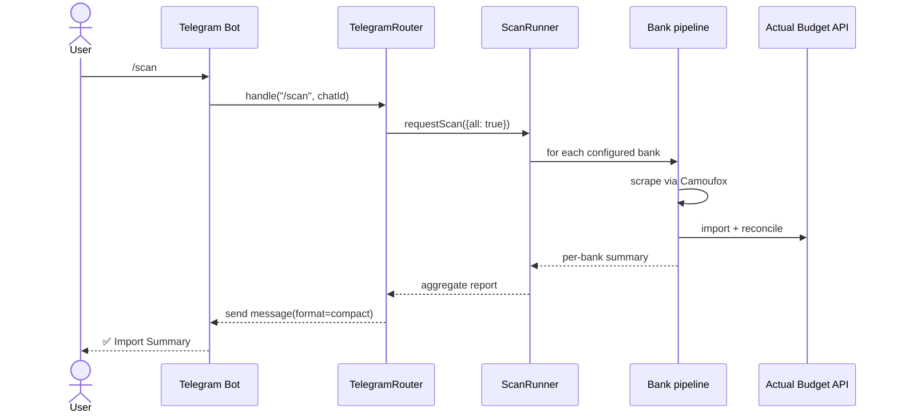
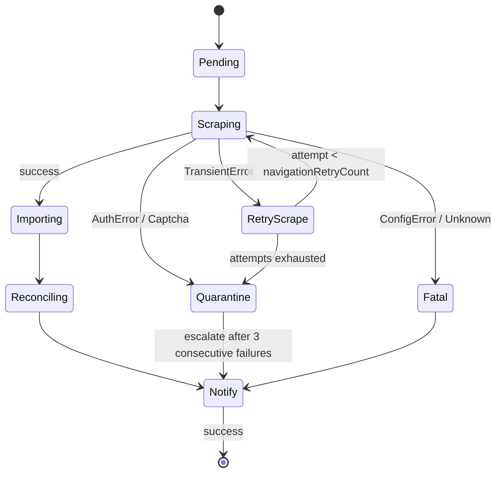

# Architecture

The importer is a small Node.js (ES2022) process that orchestrates three external systems:

1. The **bank** — accessed through the [`@sergienko4/israeli-bank-scrapers`](https://github.com/sergienko4/israeli-bank-scrapers) Camoufox-powered scraper library.
2. **Actual Budget** — accessed through the official [`@actual-app/api`](https://www.npmjs.com/package/@actual-app/api) client.
3. **Notifications** — Telegram bot (long-polling) and HTTP webhooks (Slack / Discord / plain JSON).

## End-to-end flow

```mermaid
flowchart LR
    A[Bank website] -- credentials --> B[israeli-bank-scrapers<br/>Camoufox]
    B -- transactions --> C[Importer]
    C -- normalize + categorize --> D[@actual-app/api]
    D -- sync --> E[Actual Budget server]
    C -- summary + alerts --> F[Telegram bot]
    C -- summary --> G[Webhook<br/>Slack / Discord / plain]
```

A run iterates banks defined in `config.json`. For each bank: scrape → normalize → import → reconcile (optional) → publish notification. Banks run sequentially; `delayBetweenBanks` adds a configurable pause between them.

## Telegram command flow

The Telegram bot listens **alongside** the cron scheduler — both share the same `ScanRunner`. If an import is already running, an incoming command waits instead of starting a duplicate.



The same router dispatches `/preview` (dry-run), `/retry` (last-failed-only), `/status`, `/logs N`, `/watch`, `/check_config`, `/help`, and `/import_receipt` (OCR via tesseract.js + sharp preprocessing).

## Error / retry state machine

Each bank import passes through a small state machine. Failures are categorized so the operator gets actionable advice instead of a stack trace.



- **TransientError** — network blip, page-load timeout. Retries up to `navigationRetryCount` times (per-bank, default `0`).
- **AuthError** — invalid credentials, password change required. No retry; emits an alert with actionable text.
- **ConfigError** — invalid `targets`, missing field. Halts the bank immediately.
- **Quarantine** — bank skipped this run. After 3 consecutive failures the next notification adds an escalation tag.

## Source-tree map

```text
src/
├── Index.ts                       # process entrypoint
├── Config/                        # zod schemas + loader (+ encrypted-config)
├── Scrapers/                      # one file per bank + shared base
├── Importers/                     # @actual-app/api client + reconcile
├── Categorization/                # history / translate modes
├── SpendingWatch/                 # rule evaluator + alert formatter
├── Notifications/                 # Telegram bot + webhook sender + formatters
├── Logging/                       # pino + format auto-derive
├── Scheduling/                    # cron-parser + ScanRunner
└── Telegram/
    ├── Router.ts                  # /scan, /preview, /status, /logs, ...
    ├── ReceiptImport/             # tesseract.js + sharp
    └── OtpForwarder/              # SMS → bot adapter (Android + iPhone)
```

For the full TypeDoc API reference, visit <https://sergienko4.github.io/israeli-bank-scrapers-to-actual-budget/api/>.
