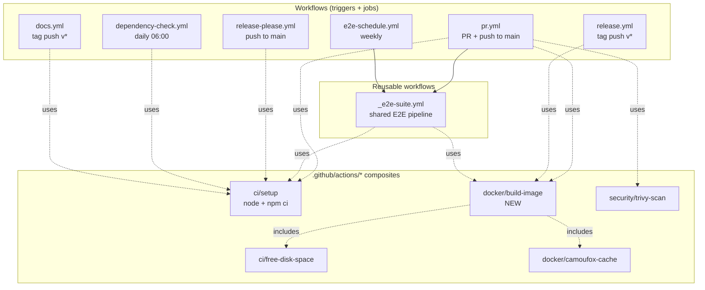
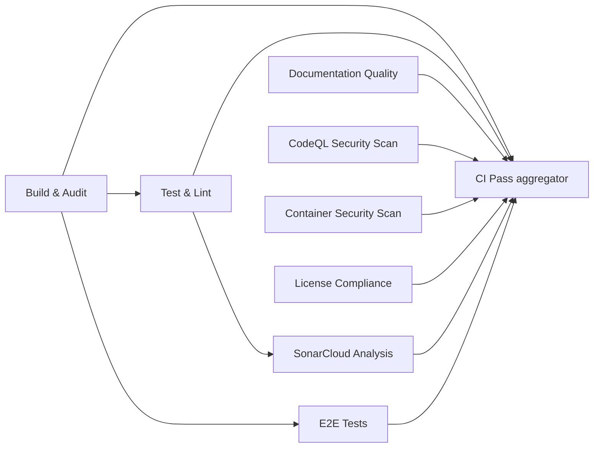

# CI/CD Pipeline Architecture

This document describes the CI/CD architecture for this project. Source of
truth for all CI values lives in [`.github/config/ci-config.yml`](https://github.com/sergienko4/israeli-bank-scrapers-to-actual-budget/blob/main/.github/config/ci-config.yml).

## Overview

The PR DAG lives **inline in `pr.yml`** as the single source of truth. Other
workflows (`release.yml`, `e2e-schedule.yml`, etc.) compose the same logic via
**composite actions** under `.github/actions/*`. Shared values live in
`.github/config/ci-config.yml`. The only reusable workflow is
`_e2e-suite.yml`, which is shared by `pr.yml` (per-PR) and `e2e-schedule.yml`
(weekly cron).

> **Looking for the release → deploy flow** (merge → `release-please` → tag →
> `release.yml` images + `docs.yml` site)? That end-to-end journey has its own
> page: [Release &amp; Deployment Pipeline](release-pipeline.md). This page
> covers the **PR gate** that precedes it.



> **Why inline, not a `_ci.yml` reusable workflow?** Reusable workflows
> always prefix nested job check-names with the calling job's name
> (e.g. `ci / Build & Audit`). The branch-protection ruleset on `main`
> requires bare names (e.g. `Build & Audit`), so the PR DAG MUST live
> at the top level of `pr.yml`. DRY across workflows is achieved through
> composites and central config instead.

## The PR DAG (`pr.yml`)



8 parallel jobs at peak (well under GitHub Free's 20-concurrent limit).

## Required check-name preservation

Branch protection requires these 8 exact names. Every `name:` in `pr.yml`
matches this list verbatim:

| Required name              | Emitter                                |
|----------------------------|----------------------------------------|
| `Build & Audit`            | `pr.yml` → `build` job                 |
| `Test & Lint`              | `pr.yml` → `validate` job              |
| `Documentation Quality`    | `pr.yml` → `docs` job                  |
| `CodeQL Security Scan`     | `pr.yml` → `security` job              |
| `Container Security Scan`  | `pr.yml` → `trivy` job                 |
| `License Compliance`       | `pr.yml` → `licenses` job              |
| `SonarCloud Analysis`      | `pr.yml` → `sonar` job                 |
| `E2E Tests / E2E Tests`    | `pr.yml` → `e2e` job → `_e2e-suite.yml`|

Optional new check (not required):

| Optional name | Emitter                          |
|---------------|----------------------------------|
| `CI Pass`     | `pr.yml` → `ci-pass` aggregator  |

## Central config: `.github/config/ci-config.yml`

Holds all CI-only constants in one file:

| Section    | Contents                                            |
|------------|-----------------------------------------------------|
| `project`  | name, owner, repo, repo_url, dockerhub_repo, license|
| `runtime`  | node version, npm version, python version           |
| `docker`   | image name, tag aliases, platforms                  |
| `ci`       | runner OS, timeouts, trivy severity list            |
| `paths`    | config file locations                               |
| `badges`   | shields.io / gist endpoints                         |
| `actions`  | pinned action major versions (single allow-list)    |
| `readme`   | marker allow-list + supported-banks data            |

## Marker fragments

`scripts/render-readme-meta.mjs` reads `.github/config/ci-config.yml` +
`package.json` and rewrites only the content between markers like:

```markdown
<!-- meta:badges:start -->
... rendered content ...
<!-- meta:badges:end -->
```

| Marker name        | Rendered in                                   |
|--------------------|-----------------------------------------------|
| `badges`           | README.md, README.docker-hub.md               |
| `supported-banks`  | README.md, README.docker-hub.md               |
| `tech-stack`       | README.md                                     |
| `docker-image`     | README.md                                     |
| `dockerhub-tags`   | README.docker-hub.md                          |

Run modes:

```bash
npm run meta:render   # write changes
npm run meta:check    # exit 1 on drift (used in CI)
npm run meta:markers  # bash-validate marker pair structure
```

The renderer is **idempotent** (running twice produces identical bytes) and
**refuses** to run on malformed markers or unknown marker names.

## Pinning policy

- **GitHub Actions:** pinned to the **major tag** (e.g., `actions/checkout@v7`).
  See the `actions.pinned_versions` array in `ci-config.yml` for the
  authoritative list. Workflows MUST use a tag from that list and MUST NOT
  inline a different version.
- **Dockerfile base image:** pinned to a **SHA digest** (supply-chain
  hardening for the runtime image).
- **SHA pinning of actions** is **deferred**. Tradeoff: at current scale the
  maintenance burden (manually bumping ~25 SHAs every minor) outweighs the
  supply-chain marginal benefit on top of Dependabot's grouped weekly
  updates. Revisit when the repo reaches > 50 actions or after a supply-chain
  incident in this ecosystem.

## Composite: `docker/build-image`

Consolidates the Docker build sequence used by `pr.yml` (trivy), `release.yml`
(smoke + push), and `_e2e-suite.yml`. Wraps:

1. `ci/free-disk-space` composite
2. `docker/camoufox-cache` composite
3. `docker/setup-buildx-action`
4. `docker/build-push-action`

Inputs (5 max — see plan §R6): `tag`, `platforms`, `push`, `load`,
`cache-suffix`, `labels`.

## Secrets matrix

NO `secrets: inherit` anywhere. Every reusable workflow call lists explicit
mappings.

| Secret                  | Used by                                  |
|-------------------------|------------------------------------------|
| `GITHUB_TOKEN` (built-in) | many                                   |
| `RELEASE_TOKEN`         | release.yml, release-please.yml          |
| `SONAR_TOKEN`           | `pr.yml` → sonar job                     |
| `SONAR_ORG`             | `pr.yml` → sonar job                     |
| `SONAR_PROJECT_KEY`     | `pr.yml` → sonar job                     |
| `DOCKERHUB_USERNAME`    | release.yml                              |
| `DOCKERHUB_TOKEN`       | release.yml                              |
| `GIST_SECRET`           | release-please.yml (badge job)           |
| `E2E_TELEGRAM_BOT_TOKEN`| `pr.yml` → e2e → `_e2e-suite.yml`        |
| `E2E_TELEGRAM_CHAT_ID`  | `pr.yml` → e2e → `_e2e-suite.yml`        |

## Dependabot grouping

`.github/dependabot.yml` groups updates into 3 weekly PRs per ecosystem
(Monday 06:00 Asia/Jerusalem):

- **npm** — 5 groups (eslint, vitest, typescript-tooling, pino, individual);
  IGNORES `@actual-app/api` and `@sergienko4/israeli-bank-scrapers` (those
  are handled daily by `dependency-check.yml`).
- **docker** — base image bumps only.
- **github-actions** — 4 groups (actions-core, docker-actions, codeql,
  security-actions).

## Pre-commit hook

`.husky/pre-commit` runs the same 18 gates locally and is **OUT OF SCOPE**
for this consolidation per project mandate (CLAUDE.md). Any future drift
between the hook and CI is the developer's responsibility.

## Adding a new check

1. Add the job to `pr.yml` with a clear `name:`.
2. If it needs new secrets, reference them via `${{ secrets.X }}` in the
   job's `env:` block; secret presence checks belong in steps (job-level
   `if:` cannot access the `secrets` context).
3. If it needs a new central value, add it to `.github/config/ci-config.yml`
   under the appropriate section.
4. If it's branch-protection-required, add the exact `name:` to the ruleset.
5. Update the table in this document.

## Rollback plan

If `pr.yml` breaks post-merge (e.g., required check name not emitting):

1. Revert the squash-merge commit.
2. Restore the pre-PR state of: `pr.yml`, `release.yml`, `release-please.yml`,
   `dependency-check.yml`, `docs.yml`, `_e2e-suite.yml`, `package.json`.
3. Delete the new infra: `.github/config/`,
   `.github/actions/docker/build-image/`, `scripts/render-readme-meta.mjs`,
   `scripts/check-readme-markers.sh`, `tests/render-readme-meta.test.ts`,
   `.github/dependabot.yml` (revert to previous form), this file.

No data involved.
