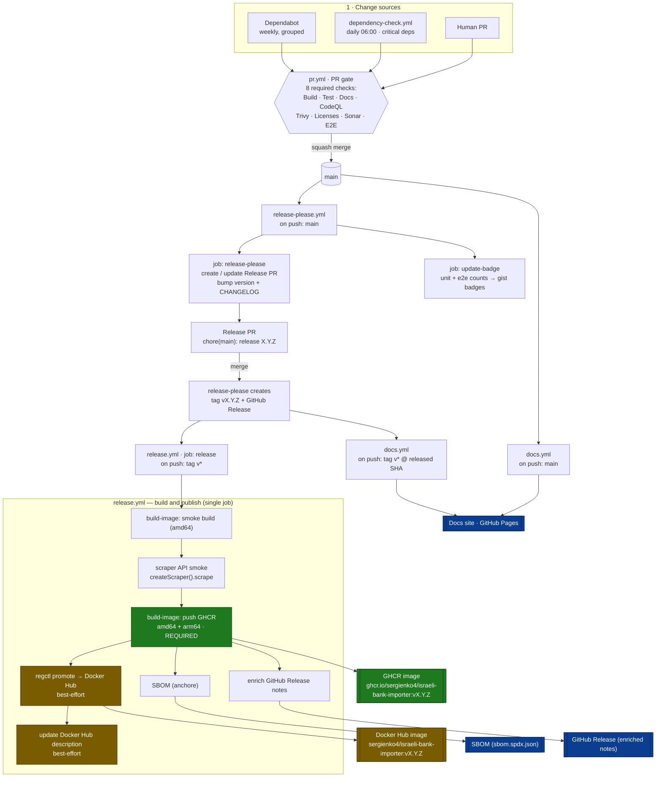
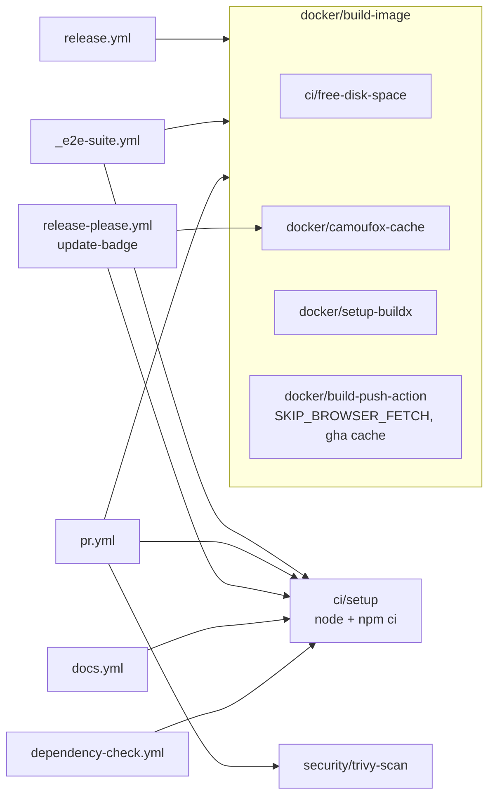

# Release &amp; Deployment Pipeline

**One place** to see how a change becomes a published release. Everything from
a merged PR to multi-arch Docker images, an enriched GitHub Release, an SBOM,
and the live docs site — as a single directed flow instead of six workflow
files you have to read side-by-side.

- **Release orchestration:** [`release-please.yml`](https://github.com/sergienko4/israeli-bank-scrapers-to-actual-budget/blob/main/.github/workflows/release-please.yml)
- **Deployment (images):** [`release.yml`](https://github.com/sergienko4/israeli-bank-scrapers-to-actual-budget/blob/main/.github/workflows/release.yml)
- **Deployment (docs):** [`docs.yml`](https://github.com/sergienko4/israeli-bank-scrapers-to-actual-budget/blob/main/.github/workflows/docs.yml)

For the **PR-check DAG** (the 8 required checks that gate a merge) see the
companion [CI/CD Pipeline](ci-pipeline.md) page — this page picks up **after**
a PR is green and merged.

---

## The whole flow, in one DAG

**Legend:** green = required (release fails if it fails) · amber =
best-effort (logged as a warning, never fails the release) · blue = published
output.

---

## At a glance

| # | Stage | Workflow | Trigger | Key jobs / steps | Produces |
|---|-------|----------|---------|------------------|----------|
| 1 | Feed | `dependency-check.yml` | daily 06:00 UTC | `npm outdated`/`update` critical deps → type-check → draft PR | dep PR |
| 1 | Feed | Dependabot | weekly (Mon 06:00) | grouped npm / docker / actions PRs | dep PRs |
| 2 | Gate | `pr.yml` | PR + push to `main` | 8 required checks + `CI Pass` aggregator | green merge |
| 3 | Release PR | `release-please.yml` → `release-please` | push to `main` | create/update Release PR (version + CHANGELOG) | Release PR |
| 3 | Badges | `release-please.yml` → `update-badge` | push to `main` | run unit + E2E, push counts to gist | 2 shields badges |
| 3 | Docs | `docs.yml` | push to `main` | TypeDoc + `mkdocs build --strict` | Pages deploy |
| 4 | Tag | `release-please.yml` | merge Release PR | create tag `vX.Y.Z` + GitHub Release | tag + release |
| 5 | Images | `release.yml` → `release` | push tag `v*` | smoke → GHCR push → Docker Hub promote → SBOM → notes | images + SBOM |
| 5 | Docs | `docs.yml` | push tag `v*` | rebuild at released SHA | Pages deploy |

---

## `release.yml` step order (the deploy job)

The whole deployment is a **single `release` job**; there is no fan-out to
other jobs. Steps, in order:

1. **Checkout** at the tag (`fetch-depth: 0` for changelog stats).
2. **Overlay CI tooling** — only on `workflow_dispatch`, so a re-published old
   tag uses today's composite actions while keeping the tag's image content.
3. **Determine tag** → `verify tag matches `config/release-please/manifest.json`` →
   **verify CHANGELOG entry**.
4. **Login** to Docker Hub (best-effort) and **GHCR** (required).
5. **Extract metadata** for both registries.
6. **Build smoke image (amd64)** via `docker/build-image`, then run the
   **scraper API smoke test** (`createScraper().scrape` must exist) inside it.
7. **Push to GHCR** — `amd64 + arm64`, `push: true`. **This is the required
   publish target.**
8. **Install regctl** → **promote GHCR → Docker Hub** (`regctl image copy`,
   best-effort). regctl is used instead of a second buildx push because Docker
   Hub's edge proxy rejects BuildKit's concurrent multi-arch uploads.
9. **SBOM** (anchore, scanned from the GHCR image) → **enriched release notes**
   → **attach SBOM + notes to the GitHub Release** → **update Docker Hub
   description** (best-effort).

> **GHCR is primary and required; Docker Hub is a best-effort mirror.** If
> Docker Hub auth or push fails, the release still succeeds and the notes
> advertise only the GHCR pull command.

---

## Reused building blocks (composite actions)

Every build path funnels through the same composites, so a fix lands once and
propagates everywhere.

`_e2e-suite.yml` is the only **reusable workflow** (called by `pr.yml` and
`e2e-schedule.yml`); it builds the `:e2e` image, seeds a budget, runs the
scraper smoke + import runs, then the full E2E suite. `update-badge` needs
`docker/camoufox-cache` because `portal-ui.e2e.test.ts` launches the product's
Camoufox browser and never skips.

---

## Secrets by workflow

| Secret | Used by |
|--------|---------|
| `GITHUB_TOKEN` (built-in) | GHCR login, Pages, SBOM |
| `RELEASE_TOKEN` | `release-please.yml`, `release.yml` (release edits), `dependency-check.yml` |
| `DOCKERHUB_USERNAME` / `DOCKERHUB_TOKEN` | `release.yml` (Docker Hub mirror + description) |
| `GIST_SECRET` | `release-please.yml` → `update-badge` |
| `SONAR_TOKEN` / `SONAR_ORG` / `SONAR_PROJECT_KEY` | `pr.yml` → sonar |
| `E2E_TELEGRAM_BOT_TOKEN` / `E2E_TELEGRAM_CHAT_ID` | `_e2e-suite.yml`, `release-please.yml` → `update-badge` |

No `secrets: inherit` anywhere — every reusable-workflow call maps secrets
explicitly.

---

## Publish targets

| Target | Image ref | Status |
|--------|-----------|--------|
| GHCR | `ghcr.io/sergienko4/israeli-bank-importer:vX.Y.Z` | **primary — release fails if this fails** |
| Docker Hub | `sergienko4/israeli-bank-importer:vX.Y.Z` | mirror — best-effort, promoted from GHCR via regctl |
| GitHub Release | tag `vX.Y.Z` | enriched notes + `sbom.spdx.json` attached |
| GitHub Pages | `https://sergienko4.github.io/israeli-bank-scrapers-to-actual-budget/` | docs site |

Both image tags are byte-identical multi-arch manifest lists
(`linux/amd64`, `linux/arm64`).

---

## Cutting a release (operator steps)

1. Merge feature PRs to `main` with **conventional-commit** titles
   (`feat:` minor, `fix:`/`refactor:` patch). `release-please` keeps a Release
   PR up to date automatically.
2. When ready to ship, **merge the Release PR** (`chore(main): release X.Y.Z`).
3. `release-please` tags `vX.Y.Z` and opens a GitHub Release; the tag push then
   fires `release.yml` (images) and `docs.yml` (docs) in parallel.
4. Confirm the **Docker Build &amp; Publish** run is green and pull
   `ghcr.io/sergienko4/israeli-bank-importer:vX.Y.Z`.

## If the deploy fails

- **`buildx failed: ... BlobNotFound` / cache copy error** — a transient
  `type=gha` build-cache eviction. The images build deterministically, so
  **re-run the failed `release.yml` run** (`gh run rerun <id> --failed`); it
  republishes the same tag.
- **Docker Hub push failed** — non-fatal by design; the image is on GHCR. Pull
  from GHCR or re-run to retry the mirror.
- **`Tag vX.Y.Z does not match manifest`** — the tag was pushed out of band;
  it must equal `config/release-please/manifest.json`.
